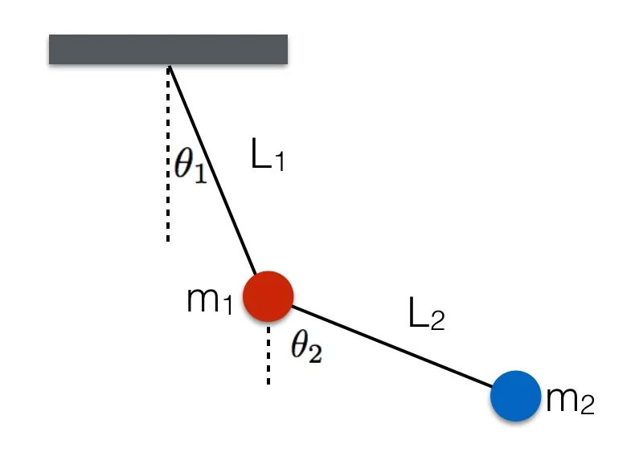

# Modelisation of a Chaotic Double Pendulum with LSTM

In this project I model the behaviour of a Double Pendulum with LSTM, and compare it with a Finite Difference solver.

The interesting aspect with solving partial derivative equations with Deep Neural Networks is that it is extremely fast to generate simulations. It takes a lot of time to train the models, but once it is trained, it is ready.


https://user-images.githubusercontent.com/93766133/219543549-18cfe600-92d2-40b6-a9f0-c59c08344018.mp4


## Contents
- [What is a double pendulum?](#what-is-a-double-pendulum)
- [Conclusion](#conclusion)
- [Usage](#usage)
- [References](#references)


## What is a Double Pendulum

<p align="center">
 
</p>

A pendulum is a simple mechanical device consisting of a mass (or bob) suspended from a fixed point by a string, rod, or wire. When the mass is pulled to one side and released, it swings back and forth in a periodic motion.

When a pendulum is set into motion, it can exhibit a behavior known as chaos. Chaos refers to a complex and unpredictable behavior that emerges from simple and deterministic systems.

In the case of a pendulum, chaos can occur when the motion becomes sensitive to small variations in the initial conditions. This means that tiny differences in the initial position, velocity, or angle of release can result in significantly different trajectories over time. As a result, the motion of a pendulum can become chaotic and appear random.


## Usage


 - Clone the repository
 ```bash
 git clone 'git@github.com:FrancoisPorcher/double-pendulum.git' 
 ```
 - Install dependencies
 ```bash
 pip install -r requirements.txt
 ```
 - Run the `main` file! Nothing else to do! (But feel free to explore the other files)
 ```bash
 main.ipynb
 ```

## Conclusion

This was just a test to see how LSTM performs on time series describing the chaotic path of a double pendulum.
Next steps could be to use Deep Reinforcement Learning to find equlibrium points.

Physics Informed Neural Networks or Noether Neural Networks

## References

> - [1] [Double Pendulum - Wikipedia](https://en.wikipedia.org/wiki/Double_pendulum). 
> - [2] Bálint Hantos [Solving differential equations:
Double pendulum and deep learning](https://icsabai.github.io/simulationsMsc/dvtulf_sd.pdf). 
> - [3] Nicolas James [Hamiltonian and Lagrangian Mechanics](http://nicf.net/articles/hamiltonian-mechanics/). 


                                                    


